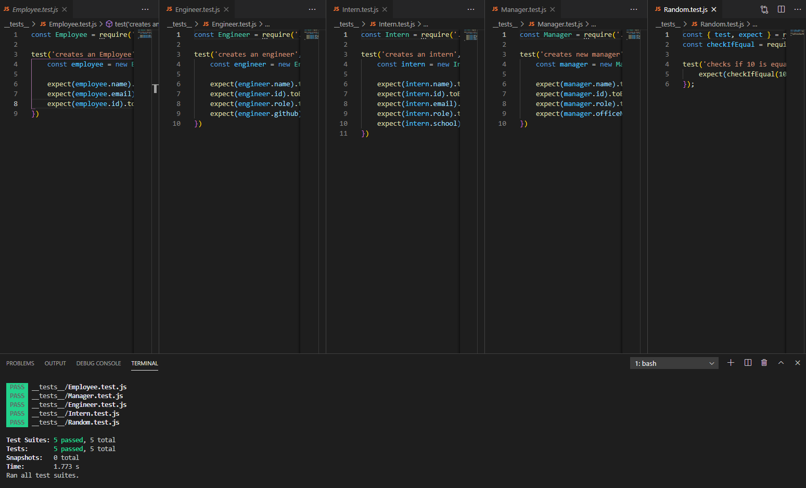
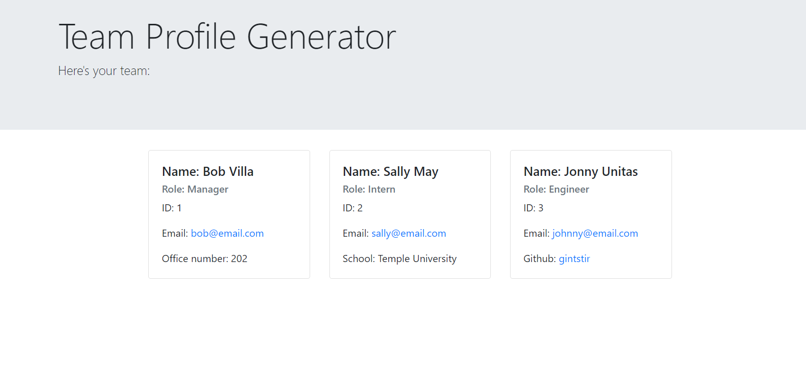

  # **TPG Team-Profile-Generator**       

  ## **Description**

  A node.js app that uses Inquirer to create employee profile cards based on user input.  

  ## **Table of Contents**

  * *[Installation](#installation)*
  * *[Usage](#usage)*
  * *[Contributing](#contributing)*
  * *[Technology](#technology)*
  * *[Tests](#tests)*
  * *[Questions](#questions)*
  * *[License](#license)*
  
   
  ## **Installation**
  
  After forking the project run `npm i` to install all necessary dependencies.  Use the command `node index.js` to start the profile generator.

  ## **Usage**

  use `node index.js` to invoke the application from the command line.
  
  ### *Screenshots*
  
  > 

  > 

  ## **Contributing**

  Please refer to the **[Contributor Covenant](https://www.contributor-covenant.org/)** for contribution guidelines.

  ## **Technology**

  Technologies Used:
  - Jest
  - Inquirer
  - Javascript
  - HTML
  - Bootstrap

  ## **Tests**  
  
  Use the command `npm run test` from the command line to run all tests. You can also run tests individually by using the command `npm run test <insert Test name>`.  Pass/fail status will be displayed in the command line.

  ## **Questions**

  For any questions, comments, or feedback please feel free to reach out:  
  - [Github](https://github.com/Gintstir) 
  - <gint.stirbys@gmail.com>

  ## **License** 

  Copyright © Gintautas Stirbys, 2021.  All Rights Reserved.

  This Project is licensed under the **[MIT](https://opensource.org/licenses/MIT)** license.

           
